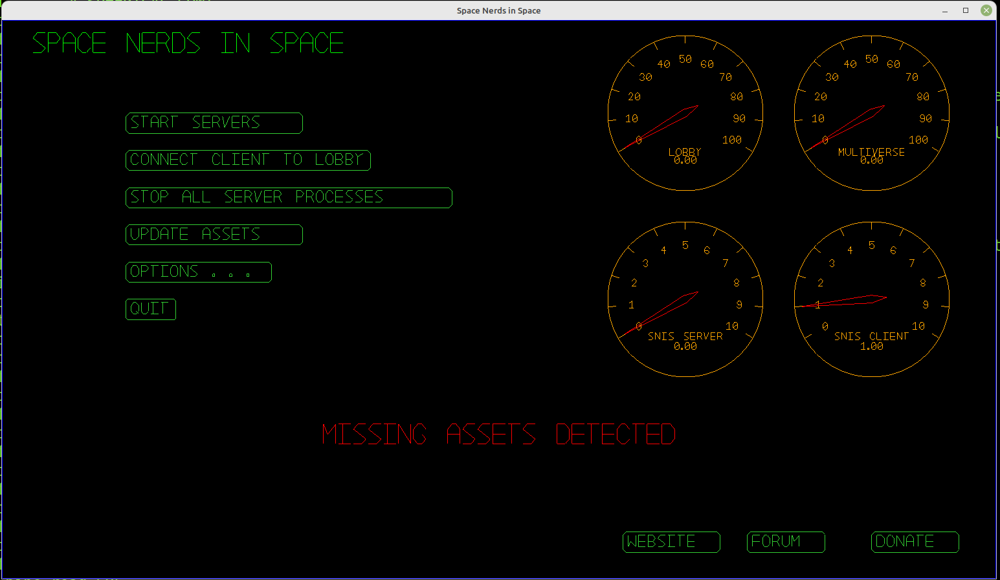
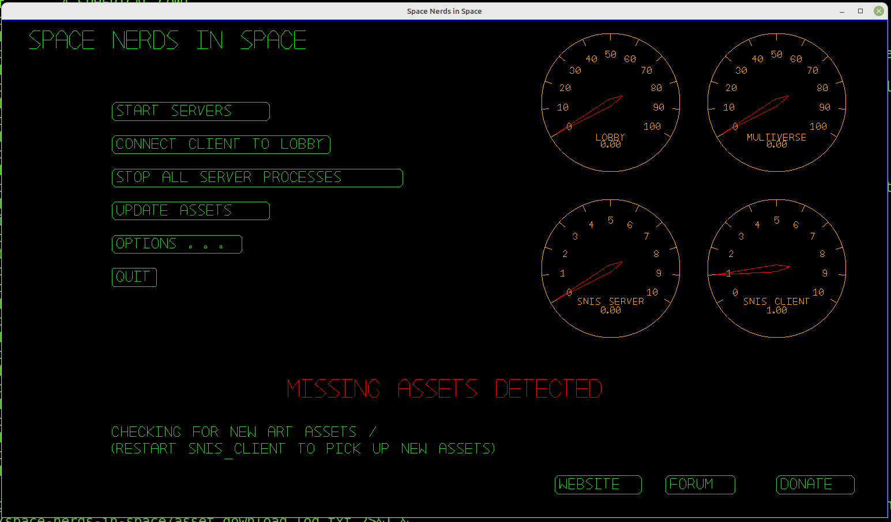
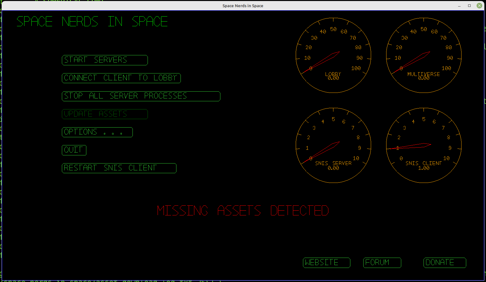
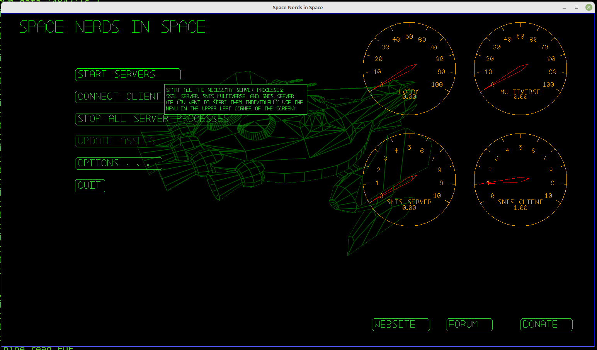
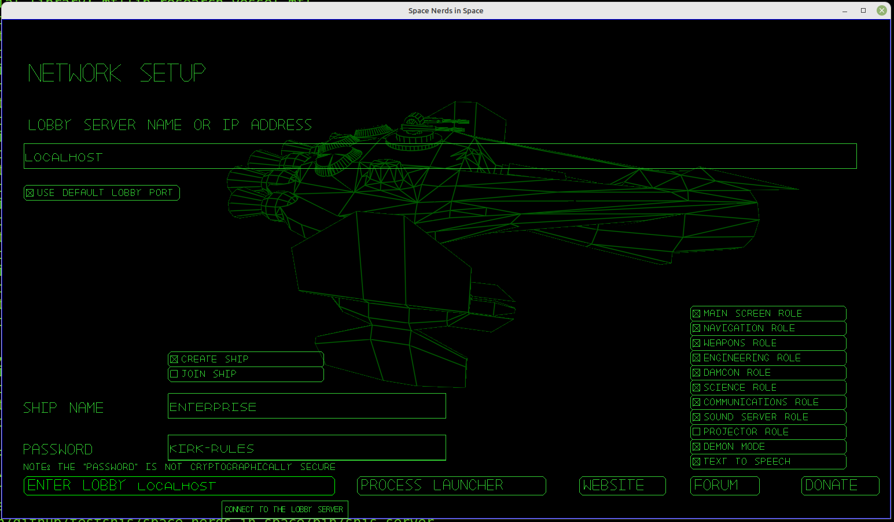
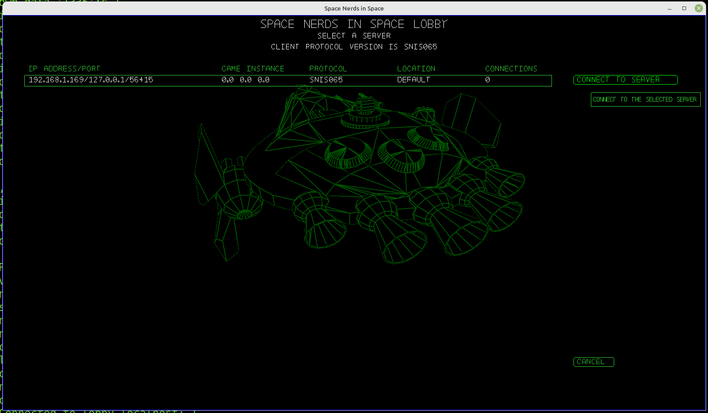
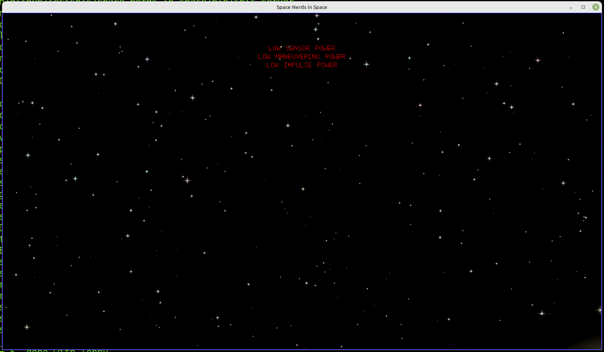
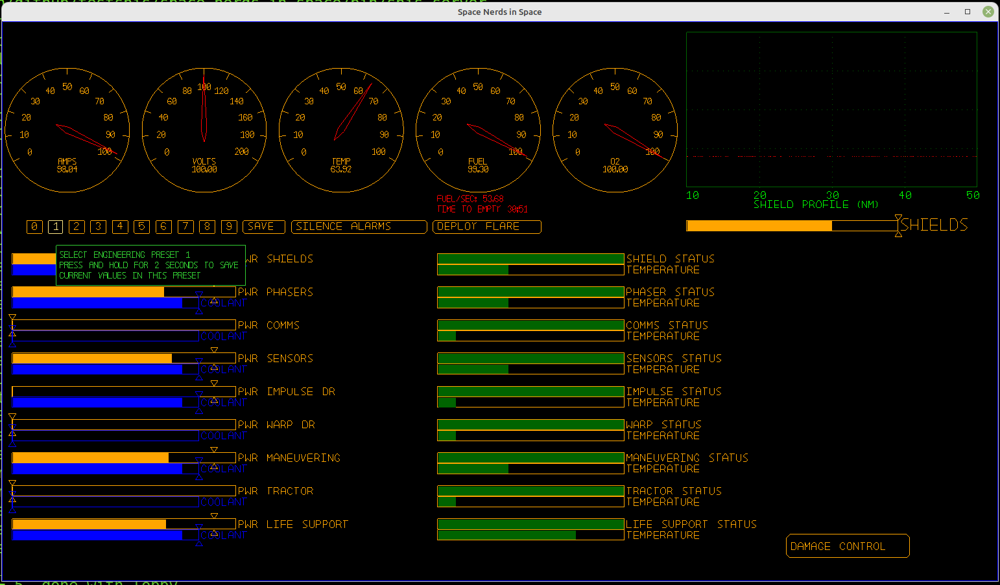
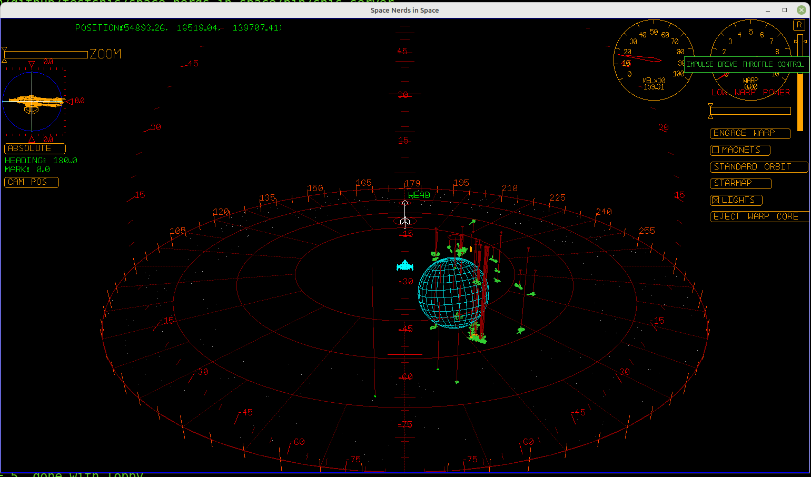

[Space Nerds In Space](https://smcameron.github.io/space-nerds-in-space/ "Space Nerds In Space website")
is an open source multiplayer networked spaceship bridge
simulator game inspired by another game called "Artemis Spaceship Bridge Simulator"
It is still a work in progress, but it is substantially far along, and reasonably
free of bugs as far as I know (the game should not crash, in other words.)

Here is some video from February 2019, at HackRVA in Richmond, Virginia:

[](https://www.youtube.com/watch?v=3fFl0VH-4zA)

Features:

* Terminals for Navigation, Weapons, Engineering, Damage Control,
  Comms, Science, and Game Master.
* Multi-crew (multiple bridges) supported
* Terminals may join/leave/re-join games at any time.
* Asteroid mining
* Bounty hunting
* Travel between instances of the game via warp gates in an arbitrarily
  large universe of solar systems.
* Dock at starbases to repair your ship, buy/sell various commodities,
  sell mined ore, obtain warp gate tickets, etc.
* Lua scripting API for mission scenarios.
* Voice chat
* And of course, fly around and shoot stuff.

Note: This game is meant to be played on a LAN with all players in the same room.
Bandwidth requirements are on the order of 100k/s per client.

1. How to build the game from source (or see below):

	https://smcameron.github.io/space-nerds-in-space/#buildinstructions

2. How to run the game on a single machine (single player):

	https://smcameron.github.io/space-nerds-in-space/#singlemachineinstructions

3. How to run with a multi-player LAN setup:

	https://smcameron.github.io/space-nerds-in-space/#multiplayerinstructions

If you would like to help work on this project, see [CONTRIBUTING.md](https://github.com/smcameron/space-nerds-in-space/blob/master/CONTRIBUTING.md).
There is also a guide to the code here:
[Hacking Space Nerds In Space](http://htmlpreview.github.io/?https://github.com/smcameron/space-nerds-in-space/blob/master/doc/hacking-space-nerds-in-space.html).
Here is documentation for the
[Lua scripting API](https://github.com/smcameron/space-nerds-in-space/blob/master/doc/lua-api.txt)
intended to be used for creating "mission scripts".


# Build Instructions

Here's a quick preview of the build instructions detailed below:

0. Acquire necessary hardware (some linux machines, network switch, cables, projector, stereo, etc.)
1. Clone git repository or obtain source tarball and unpack it.
2. Install dependencies
3. Build the code (type "`make`")
5. Run the game (type "`bin/snis_client`")
6. Download additional art assets
7. Restart `snis_client`

[Here is a long, boring video demonstrating how to install](https://www.youtube.com/watch?v=tCokfUtZOqw)

Alternatively, if you run on other OS than linux, or if you do not (or cannot) install the necessary dependencies over your whole system, you can build and use a ready to play [Docker](https://www.docker.com/) image. See [Docker Install](#alternative-docker-install)

## Step 0: Acquire Hardware and OS

This is a linux game.  You will need a computer running linux that has
a reasonably decent GPU.  A Raspberry Pi 4 (with 4Gb RAM) and heatsinks is
sufficiently powerful to run the game at 720p for <em>some</em> screens, namely NAVIGATION,
ENGINEERING, DAMAGE CONTROL, SCIENCE and COMMS, but is <em>not</em> really good enough
for the MAIN VIEW, WEAPONS, or DEMON screens (you'll see very low FPS).
[Here is a long boring youtube video demonstrating installation and running SNIS on a Raspberry Pi 4B](https://www.youtube.com/watch?v=wdy4ICZqc68)
if you want to see for yourself what it's like.
Older Raspberry Pis
are generally **not** powerful enough to run the game.

It is possible to run the game entirely on a single linux laptop, but for the full and
proper spaceship experience you will want six linux computers, a network switch,
a projector or large TV, and a stereo system for audio in a reasonably dark
room.

The game is currently developed using [Mint 20.3](https://www.linuxmint.com/)
It is within the realm of possibility that the game could be made to build
and work on Mac OSX (it has been done before, but not since 2014 or so.)
You're on your own if you want to try to run it on Mac, and my understanding
is that newer Macs don't support OpenGL, which means you're out of luck.

## Step 1: Download the Source Code

The source code is here:
[Space Nerds In Space github page](https://github.com/smcameron/space-nerds-in-space)

**NOTE: Do NOT perform these steps as root!**

To get the source code, there are three methods:

- If you are a registered github user, type (as a non-root user):

```
> git clone git@github.com:smcameron/space-nerds-in-space.git
```

- If not a registered github user, you can still use git with https.  Type (as a non-root user):

```
> git clone https://github.com/smcameron/space-nerds-in-space.git
```

- Finally, you can just download a snapshot zipfile without using git at all:
  - [https://github.com/smcameron/space-nerds-in-space/archive/master.zip](https://github.com/smcameron/space-nerds-in-space/archive/master.zip)

After downloading the zip file, you must unpack the zip file.  Type (as a non-root user):

```
> unzip space-nerds-in-space-master.zip
> cd space-nerds-in-space-master
```

## Step 2: Install Dependencies

There is a script, `util/install_dependencies`. In theory it can install dependencies
on apt, yum, zypper, or rpm based systems, but it has only been tried with apt based
systems. If you want to see what it will do without actually doing anything, it has
a `--dry-run` option.  Even on apt-based systems, package names are not consistent
across various linux distros so it might not do the right thing.  This is a Hard
Problem which there is no avoiding.

```
`util/install_dependencies`
```

If you don't want to run this script, or find that it does not work for you, you can
install the dependencies manually, as described below. If `util/install_dependencies`
performs its job satisfactorily, you can advance to Step 3.

```
> sudo apt-get install build-essential;
> sudo apt-get install portaudio19-dev;
> sudo apt-get install libpng-dev;
> sudo apt-get install libvorbis-dev;
> sudo apt-get install libsdl2-dev;
> sudo apt-get install libsdl2-2.0-0;
> sudo apt-get install liblua5.2-dev;
> sudo apt-get install libglew-dev;
> sudo apt-get install libttspico-utils; # optional, for text to speech
> sudo apt-get install sox; # for "play" command, used by text to speech
> sudo apt-get install libcrypt-dev; # used by bin/snis_update_assets
> sudo apt-get install libcurl-dev; # used by bin/snis_update_assets
> 
> You might also need these in addition or instead of some of the above:
>
> sudo apt-get install libcurl4-openssl-dev
> sudo apt-get install libssl-dev
>
> # Opus is needed for voice-chat, though you can compile without voice chat or,
> # you can have the Makefile download and compile opus for you instead of
> # using packages if you distro does not have Opus packages
> #
> sudo apt-get install libopus-dev; # used for voice-chat feature
> sudo apt-get install libopus0; # used for voice-chat feature
>
> # (The following are optional)
> sudo apt-get install espeak; # optional alternative to libttspico-utils
> sudo apt-get install alsa-utils; # optional alternative to sox, for "aplay" command
> sudo apt-get install openscad; # optional, only needed if you intend to work on 3D models.
>                 # Also, it is recommended to get it from http://www.openscad.org/downloads.html
>                 # as the version in the repos tends to be out of date.
> sudo apt-get install git; # Version control, useful if you're hacking on the game
> sudo apt-get install stgit; # Useful for making patches if you're hacking on the game.
> It's like [quilt](https://en.wikipedia.org/wiki/Quilt_%28software%29) but on top of git.

```

If you want to try the optional pocketsphinx based local speech recognition,
you will want the following packages:

```
> sudo apt-get install pocketsphinx-utils;
> sudo apt-get install pocketsphinx-lm-en-hub4;
> sudo apt-get install pocketsphinx-lm-en-hub4;
> sudo apt-get install libpocketsphinx1;
```

The above list may be incomplete, and these are the package names on mint 17.3 / ubuntu,
so may be different on RPM based systems.

## Step 3: Build the Code

To build the code, make sure you are in the top level
directory for the game ("space-nerds-in-space" if you
got the source using git, or "space-nerds-in-space-master" if you
downloaded the zip file), and type (as a non-root user):

```
> make
```

You should see quite a lot of output, like this:

```
>  COMPILE mathutils.c
>  COMPILE snis_alloc.c
>  COMPILE snis_socket_io.c
>
> ... many steps omitted here ...
> 
>  LINK bin/snis_server
>  LINK bin/snis_client
>  LINK bin/snis_limited_client
>  LINK bin/snis_multiverse
```

If you have problems building the code, it likely means there is some
missing dependency.  Double check that you have all the required dependencies
installed.  If the missing dependencies have to do with opus libraries, and your
distro does not have opus packages, you can run "make DOWNLOAD_OPUS=yes", and the
makefile will download the opus library source from mozilla.org and compile it
for you.

You can also file a bug report if you think you have discovered a problem
with the build process, or the instructions here.  I believe you will need a github
account to file a bug report.

- [Click here to file a bug report](https://github.com/smcameron/space-nerds-in-space/issues)


## Step 4: build openscad models (optional, not recommended)

Or you can skip to step 5 and just download the models instead (recommended).
This step will take a long time and requires that you installed OpenSCAD.
In general, unless you are working on the models, you can and should skip this step.
(Again, as a non-root user):

```
> make models
```

Note: If you intend to run the game without downloading aditional assets
(step 5, below), with just the default assets, this can be done, but
requires the additional step of running:

```
>  bin/snis_update_assets --force --destdir ~/.local/share/space-nerds-in-space --srcdir ./share/snis
```

to copy assets into ~/.local/share/space-nerds-in-space.

## Step 5: Run the game

```
> bin/snis_client
```

You should see something like this:



There are art assets not included in the source code.  Click the UPDATE ASSETS
button to fetch the assets.



After a few minutes, the assets will finish downloading. Then you can press the
RESTART SNIS CLIENT button to use the newly acquired assets.



Next, start the game servers (`snis_server`, `snis_multiverse`, and `ssgl_server`) by
clicking the START SERVERS button.



Next, connect to the lobby.


Here is the Network Setup screen.  Choose your ship name and password, and check
the MAIN SCREEN role, then click the ENTER LOBBY LOCALHOST button.



Now you will see the lobby screen, with a single snis server running.  Click on this and
the CONNECT TO SERVER button.



Finally, you are playing the game.  First you will see the MAIN VIEW -- the view out of
the window of your spacecraft.



In your brand new spacecraft, nothing is turned on. Press F4 to go to the ENGINEERING screen,
then click on the '1' to activate the first preset which gives power and coolant to all the
ship's systems.



Press F2 to go to NAVIGATION.  In the upper right corner of the screen is a vertical
slider that controls the thrusters of your ship. Click on it to begin moving forward.



## Alternative: Docker install
### Step 0: Make sure you have Docker installed
See https://docs.docker.com/engine/install

Additionally, you might want to install **nvidia-container-toolkit** to make use of you NVidia GPU.

### Step 1: Download the Source Code

```bash
git clone --depth 1 https://github.com/smcameron/space-nerds-in-space.git
cd space-nerds-in-space
```

### Step 2: Build the image
```bash
docker build -t snis:latest -f Dockerfile .
```

### Step 3: Run the client
```bash
xhost +local:root

docker run --rm -it \
    --net=host \
    --gpus all \
    --device /dev/dri \
    -e DISPLAY=$DISPLAY \
    -v /tmp/.X11-unix:/tmp/.X11-unix \
    snis:latest
```